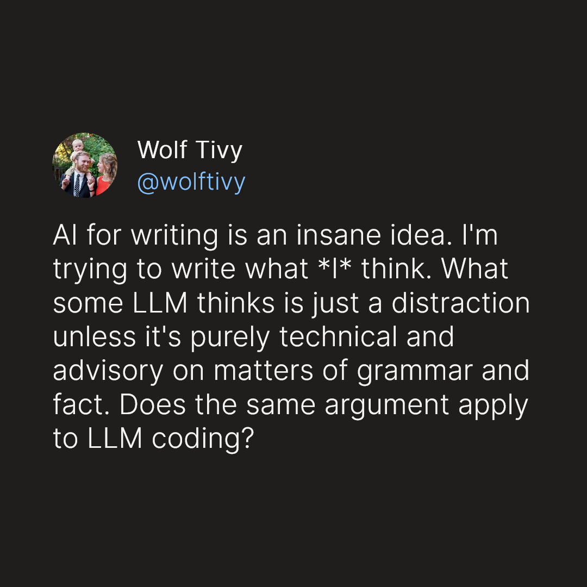

## Reference Material

- Jimmy Koppel's XOR hashing summary functions (as idea of where semantics come into play)
- Wolf Tivy's tweet

## Outline

- Reference /theory-building post
- Problem:
    - Whether or not LLM code works is actually besides the point
    - If no humans have built a theory of the domain, no humans understand the model of the world
    - So LLM code, even if it works correctly, is just CPU subroutines